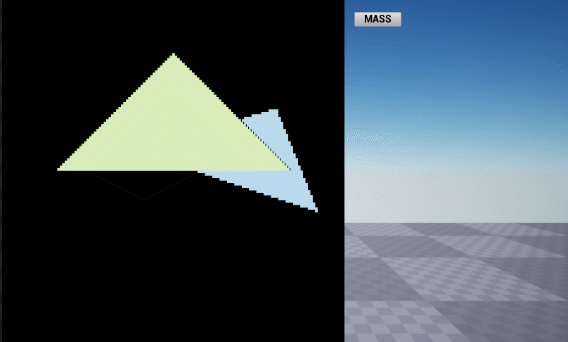
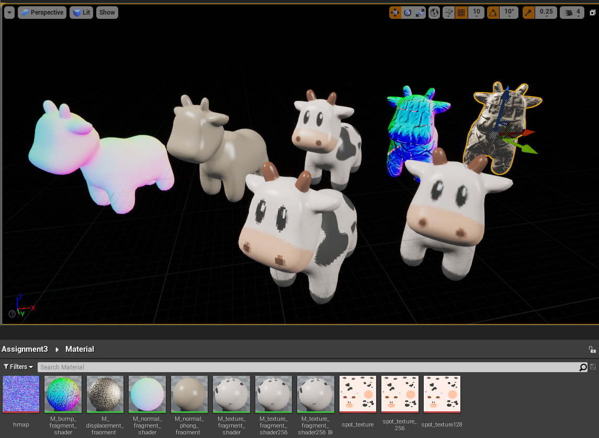
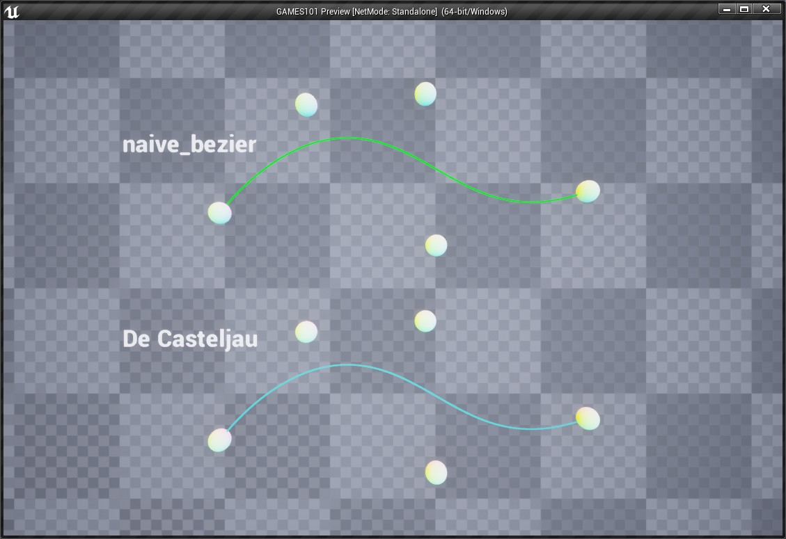
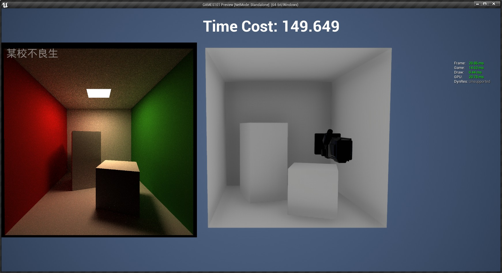

# UE4-GAMES101-HW
GAMES101 homework by using UE4

# 预览
- [作业0 矩阵初识](https://www.cnblogs.com/shiroe/p/15428717.html)

- [作业1 mvp 模型、视图、投影变换](https://www.cnblogs.com/shiroe/p/15430821.html)
  - 
  
- [作业2 光栅化和深度缓存](https://www.cnblogs.com/shiroe/p/15436920.html)
  - 
  - 
- [作业3 Blinn-Phong 模型与着色](https://www.cnblogs.com/shiroe/p/15441302.html)
  - 在材质中用HLSL实现 
   - 

- [作业4 贝塞尔曲线](https://www.cnblogs.com/shiroe/p/15442996.html)
  - 
  
- [作业5 光线与物体相交(球、三角面)](https://www.cnblogs.com/shiroe/p/15457652.html)
  - 
  
- [作业6 BVH划分算法加速求交](https://www.cnblogs.com/shiroe/p/15477198.html)
  - 
  
- [作业7 光线追踪 Path Tracing (多线程)](https://www.cnblogs.com/shiroe/p/15483600.html)
  - 
  - 
